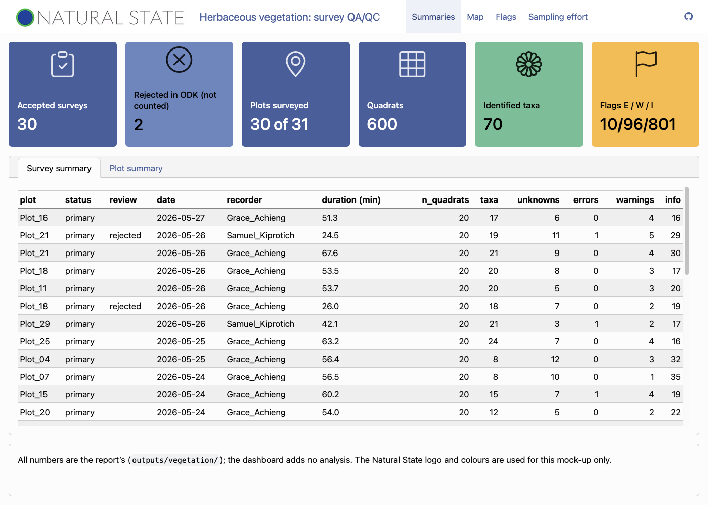
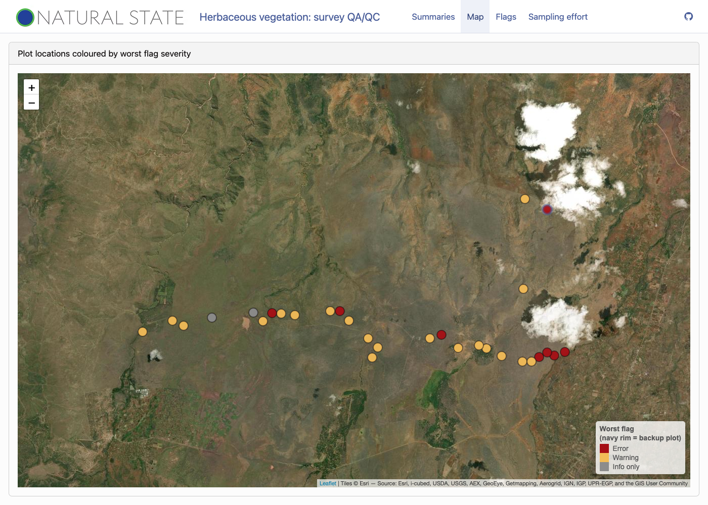
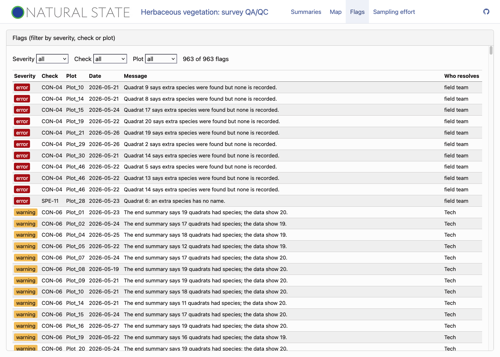

```{r setup, include=FALSE}
knitr::opts_chunk$set(echo = FALSE, warning = FALSE, message = FALSE)
library(dplyr)
library(readr)
library(stringi)

source(file = here::here("R", "vegetation", "config.R"))
cfg <- veg_config
paths <- cfg$paths

# Every number in this handoff is read from outputs/vegetation/ (tracked), from
# data/processed/ (written by R/vegetation/01 to 04), from the raw export headers or from
# the config. Nothing is typed by hand.
# trim_ws = FALSE: a stray space in a typed name is data, not noise
read_out <- function(path) read_csv(file = path, show_col_types = FALSE, trim_ws = FALSE)
catalogue <- read_out(path = paths$catalogue)
flags <- read_out(path = paths$flags)
survey_sum <- read_out(path = paths$survey_summary)
plot_sum <- read_out(path = paths$plot_summary)
plot_sum_sens <- read_out(path = paths$plot_summary_sens)
totals <- read_out(path = paths$totals)
effort <- read_out(path = paths$effort)
effort_sens <- read_out(path = paths$effort_sens)
locations <- read_out(path = paths$plot_locations)
excluded <- read_out(path = paths$exclusions)

all_chr <- cols(.default = col_character())
survey <- read_csv(file = paths$survey, col_types = all_chr)
quadrat <- read_csv(file = paths$quadrat, col_types = all_chr)
records <- read_out(path = paths$record_taxa)

f1 <- function(x) sprintf(fmt = "%.1f", x)
f2 <- function(x) sprintf(fmt = "%.2f", x)
f3 <- function(x) sprintf(fmt = "%.3f", x)
pct <- function(x) sprintf(fmt = "%.0f%%", 100 * x)
big <- function(x) format(x, big.mark = ",", trim = TRUE)
# Pipes inside a table cell would split the cell
cell <- function(x) stri_replace_all_fixed(str = x, pattern = "|", replacement = "\\|")

# ---- Catalogue and flag counts -------------------------------------------------------
n_checks <- nrow(catalogue)
checkmate::assert_character(x = catalogue$id, unique = TRUE, any.missing = FALSE)
sev_levels <- c("error", "warning", "info")
n_sev <- sapply(X = sev_levels, FUN = function(s) sum(catalogue$severity == s))
flag_sev <- sapply(X = sev_levels, FUN = function(s) sum(flags$severity == s))
n_flags <- nrow(flags)
flag_counts <- flags |>
  count(check_id, severity, name = "n") |>
  inner_join(
    y = select(.data = catalogue, check_id = id, level, who_can_resolve),
    by = join_by(check_id),
    relationship = "many-to-one",
    unmatched = c(x = "error", y = "drop")
  )
n_fire <- nrow(flag_counts)
zero_ids <- setdiff(x = catalogue$id, y = flag_counts$check_id)
# One severity per check, so a flag always carries the severity of its check
checkmate::assert_true(x = nrow(count(x = flag_counts, check_id)) == n_fire)

geometry_ids <- c("SPA-04", "SPA-05", "SPA-06")
group_ids <- c("STR-07", "STR-08", "STR-09", "MET-01")
stopifnot(all(is.element(el = c(geometry_ids, group_ids, "SPE-06"), set = catalogue$id)))
n_pure_sql <- n_checks - length(geometry_ids)

belt_reach <- veg_belt_reach_m(config = cfg)

# ---- Raw inputs: row counts and headers ----------------------------------------------
n_rows <- function(path) nrow(read_csv(file = path, col_types = all_chr))
raw_header <- function(path) names(read_csv(file = path, n_max = 0, col_types = all_chr))
ent <- function(name) fs::path(cfg$paths$entity_dir, paste0(name, ".csv"))
n_survey <- n_rows(path = paths$odk$survey)
n_quadrat <- n_rows(path = paths$odk$quadrat)
n_add <- n_rows(path = paths$odk$additional)
n_reg <- n_rows(path = paths$odk$register)
vegplots <- read_out(path = ent(name = "vegplots"))
n_vegplots <- nrow(vegplots)
# Joining on the wrong id: how many surveys would match vegplots.plot_uuid
n_wrong_join <- sum(is.element(
  el = survey[["plot_selection-selected_plot_uuid"]],
  set = vegplots$plot_uuid
))
n_right_join <- sum(is.element(
  el = survey[["plot_selection-selected_plot_uuid"]],
  set = vegplots$`__id`
))
stopifnot(n_right_join == nrow(survey))
n_species_list <- n_rows(path = ent(name = "species"))
n_species_extra <- n_rows(path = ent(name = "species_extra"))
n_selected_records <- sum(records$source == "selected_list")
n_records <- nrow(records)
checkmate::assert_true(x = n_records == n_selected_records + n_add)

# ---- Offsets and the time-zone artefact ----------------------------------------------
offsets <- stri_extract_last_regex(
  str = survey[["survey_begin-start_time"]],
  pattern = "[+-][0-9]{2}:[0-9]{2}$"
)
offset_values <- unique(offsets)
checkmate::assert_character(x = offset_values, len = 1, any.missing = FALSE)
dropped_offset <- function(x) {
  # The artefact: the clock time is read as UTC, the offset is ignored
  as.POSIXct(
    x = stri_sub(str = x, from = 1, length = 19),
    format = "%Y-%m-%dT%H:%M:%S",
    tz = "UTC"
  )
}
start_honoured <- veg_parse_time(x = survey[["survey_begin-start_time"]])
submitted <- veg_parse_time(x = survey$SubmissionDate)
secs_honoured <- as.numeric(difftime(time1 = start_honoured, time2 = submitted, units = "secs"))
secs_dropped <- as.numeric(difftime(
  time1 = dropped_offset(x = survey[["survey_begin-start_time"]]),
  time2 = submitted,
  units = "secs"
))
n_artefact <- sum(secs_dropped > cfg$start_after_submission_tolerance_s)
n_honoured <- sum(secs_honoured > cfg$start_after_submission_tolerance_s)
stopifnot(n_honoured == sum(flags$check_id == "TIM-03"))

# ---- Sensitivity version ------------------------------------------------------------
tot_all <- filter(.data = totals, version == "accepted")
tot_sens <- filter(.data = totals, version == "excluding_errors")
n_excl_surveys <- sum(excluded$level == "survey")
n_excl_quadrats <- sum(excluded$level == "quadrat")
excl_reasons <- count(x = excluded, level, reason)
n_excl_rejected_q <- sum(excluded$level == "quadrat" & excluded$reason == "rejected_submission")
n_excl_error_q <- sum(excluded$level == "quadrat" & excluded$reason == "error_flag_quadrat")
n_rejected <- sum(survey$ReviewState == "rejected", na.rm = TRUE)
n_plots_changed <- sum(
  filter(.data = plot_sum, surveyed)$gamma_richness !=
    filter(.data = plot_sum_sens, surveyed)$gamma_richness
)

# ---- SQL files ------------------------------------------------------------------------
sql_text <- function(file) paste(readLines(con = here::here("sql", file)), collapse = "\n")
show_sql <- function(text) {
  cat("```sql\n")
  cat(text, "\n")
  cat("```\n")
}
```

## TL;DR

- **What to build.** A job that runs after the ODK data have reached the platform and
  produces four things: staged tables (typed and joined, nothing dropped), a long `veg_flag`
  table with one row per finding, survey and plot summaries, and a plot
  location layer for a map. The tables are in `sql/vegetation_schema.sql`. The checks themselves are
  specified by the catalogue and the R reference, not by SQL.
- **The key rule.** Checks are rows of a catalogue table (`r n_checks` checks:
  `r n_sev[["error"]]` error, `r n_sev[["warning"]]` warning, `r n_sev[["info"]]` info).
  Each row holds the rule, severity, message and a `SELECT`. The runner only executes the
  rows and writes what they return. On the sample export that gives `r n_flags` flags
  (`r flag_sev[["error"]]` error, `r flag_sev[["warning"]]` warning, `r flag_sev[["info"]]`
  info) and a data set is never changed or filtered by a flag.
- **What Tech must do.** Create the tables, load the catalogue and parameter rows, write the
  staging step and one query per catalogue row (`r n_pure_sql` of `r n_checks` need no
  geometry), rebuild flags and summaries after every batch, serve the dashboard tables, and
  fix the form and entity-list issues in section 10. Done means the acceptance counts in section 12.
- **What is not Tech's decision.** Which checks exist, their severity, every tolerance and
  the species identity rule. Biometrics inserts catalogue and parameter rows; Tech never
  edits one. There is no open scientific question in this document.

## 1. Inputs and outputs

### 1.1 What arrives

The brief says the ODK data have already reached the platform. This handoff starts from the
raw tables. Four ODK Central exports and four entity lists are used.

```{r raw-tables}
raw_tbl <- tibble::tribble(
  ~`Raw table`, ~`Written by`, ~Rows, ~Key, ~`Parent key`,
  "herbaceous_veg_survey", "ODK Central", n_survey, "`KEY` (survey)", "",
  "herbaceous_veg_survey-quadrat_repeat", "ODK Central", n_quadrat, "`KEY` (quadrat)", "`PARENT_KEY` = survey `KEY`",
  "herbaceous_veg_survey-additional_species_repeat", "ODK Central", n_add, "`KEY`", "`PARENT_KEY` = quadrat `KEY`",
  "register_vegetation_plots", "ODK Central", n_reg, "`KEY`", "",
  "vegplots (entity list)", "ODK Central entities", n_vegplots, "`__id`", "",
  "species (entity list)", "ODK Central entities", n_species_list, "`__id`", "",
  "species_extra (entity list)", "ODK Central entities", n_species_extra, "`__id`", "",
  "project_team (entity list)", "ODK Central entities", n_rows(path = ent(name = "project_team")), "`__id`", ""
)
knitr::kable(x = raw_tbl, align = "llrll")
```

The row counts are those of the sample export. The raw table names above are the ODK
export names; call them whatever the platform's raw layer calls them. Everything that
follows is keyed on the ODK `KEY` columns.

### 1.2 Keys and formats that need care

- **Repeat structure.** Survey `KEY` is the quadrat `PARENT_KEY`; quadrat `KEY` is the
  additional-species `PARENT_KEY`. The `KEY` of a repeat row is its parent key plus the path
  (`.../quadrat_repeat[3]`).
- **Plot key.** The survey column `plot_selection-selected_plot_uuid` equals the `__id` of
  the vegplots entity. The vegplots column `plot_uuid` is a different id: it matches the
  registration form. Joining a survey to vegplots on `plot_uuid` matches
  `r n_wrong_join` of `r n_survey` surveys.
- **Species picked from the list.** `herb_species-selected_herb_species_uuids` holds entity
  UUIDs **separated by a space**. The derived name columns use `<br/>`; split the UUID cell
  on any white space or `<br/>`. Staging writes one `veg_species_record` row per UUID.
- **Species typed or provisional.** Species that are not on the list come through the
  additional-species repeat: `reuse_unknown` and `reuse_missing` carry an entity UUID,
  `new_unknown` and `new_missing` carry a name (`new_missing_canonical` is what the team
  typed).
- **Geopoints.** ODK exports a geopoint as four columns (`...-Latitude`, `-Longitude`,
  `-Altitude`, `-Accuracy`). The vegplots entity stores it as one string,
  `'lat lon alt acc'`, latitude first, space separated (for example
  `r filter(.data = vegplots, plot_name == "SavMon_LW_Plot_16")$geometry`).
  Staging parses it into `lat`, `lon`, `altitude_m`, `accuracy_m`; a blank is NULL.
- **Timestamps.** `SubmissionDate` is UTC (`...Z`). The form times carry the device offset
  (`r offset_values[[1]]` in the sample). Parse them as `timestamptz` with the offset honoured
  (section 9).
- **Blank means NULL.** An empty ODK cell becomes NULL; whitespace is never trimmed at
  staging, because a stray space is something the checks report.

### 1.3 Column mapping, raw to staged

The mapping below is checked against the headers of the sample export when this document
is built, so a column named here exists in the raw file.

```{r column-mapping}
mapping <- tibble::tribble(
  ~raw_table, ~raw_column, ~staged, ~type,
  "survey", "KEY", "veg_survey.survey_key", "text",
  "survey", "ReviewState", "veg_survey.review_state", "text",
  "survey", "FormVersion", "veg_survey.form_version", "text",
  "survey", "SubmissionDate", "veg_survey.submitted_at", "timestamptz",
  "survey", "survey_begin-start_time", "veg_survey.started_at, survey_date", "timestamptz, date",
  "survey", "survey_end-end_time", "veg_survey.ended_at", "timestamptz",
  "survey", "plot_selection-selected_plot_uuid", "veg_survey.plot_entity_id", "text",
  "survey", "plot_selection-plot_name", "veg_survey.plot_name", "text",
  "survey", "plot_selection-get_plot_status", "veg_survey.plot_status", "text",
  "survey", "field_team_specifics-recorder_uuid", "veg_survey.recorder_uuid", "text",
  "survey", "observations-quadrat_repeat_count", "veg_survey.declared_quadrat_count", "integer",
  "survey", "survey_end-quadrats_with_species", "veg_survey.declared_quadrats_with_species", "integer",
  "survey", "survey_end-background_geopoint-Latitude", "veg_survey.bg_lat", "double precision",
  "survey", "survey_end-background_geopoint-Accuracy", "veg_survey.bg_accuracy_m", "double precision",
  "quadrat", "KEY", "veg_quadrat.quadrat_key", "text",
  "quadrat", "PARENT_KEY", "veg_quadrat.survey_key", "text",
  "quadrat", "quadrat_number", "veg_quadrat.quadrat_number", "integer",
  "quadrat", "herbs_present", "veg_quadrat.herbs_present", "text",
  "quadrat", "herb_species-selected_herb_species_uuids", "veg_quadrat.selected_species_uuids and one veg_species_record row per UUID", "text",
  "quadrat", "herb_species-count_herb_species", "veg_quadrat.declared_species_count", "integer",
  "quadrat", "additional_species_present", "veg_quadrat.additional_species_present", "text",
  "quadrat", "location_quadrat-Latitude", "veg_quadrat.lat", "double precision",
  "quadrat", "location_quadrat-Accuracy", "veg_quadrat.accuracy_m", "double precision",
  "additional", "KEY", "veg_species_record.record_id", "text",
  "additional", "PARENT_KEY", "veg_species_record.quadrat_key", "text",
  "additional", "species_entry_mode", "veg_species_record.entry_mode", "text",
  "additional", "select_reuse_unknown", "veg_species_record.species_uuid (this or select_reuse_missing)", "text",
  "additional", "validated_name", "veg_species_record.species_name", "text",
  "additional", "new_missing_canonical", "veg_species_record.typed_name", "text",
  "register", "KEY", "veg_registration.register_key", "text",
  "register", "survey_end-end_time", "veg_registration.ended_at", "timestamptz"
)
header_of <- list(
  survey = raw_header(path = paths$odk$survey),
  quadrat = raw_header(path = paths$odk$quadrat),
  additional = raw_header(path = paths$odk$additional),
  register = raw_header(path = paths$odk$register)
)
exists_raw <- mapply(
  FUN = function(table, column) is.element(el = column, set = header_of[[table]]),
  mapping$raw_table,
  mapping$raw_column
)
stopifnot(all(exists_raw))
mapping |>
  mutate(
    raw_table = recode_values(
      raw_table,
      "survey" ~ "survey",
      "quadrat" ~ "quadrat_repeat",
      "additional" ~ "additional_species_repeat",
      "register" ~ "register_vegetation_plots"
    ),
    raw_column = paste0("`", raw_column, "`"),
    staged = paste0("`", staged, "`")
  ) |>
  knitr::kable(
    col.names = c("Raw table", "Raw column", "Staged column", "Type"),
    align = "llll"
  )
```

The other staged columns follow the same pattern (same name with `-` replaced by `_`, and
the geopoint parts in the order latitude, longitude, altitude, accuracy). The entity lists
fill `veg_plot`, `veg_species`, `veg_project_team`.

### 1.4 Outputs

| Output table | One row per | Written by | Read by |
|:---|:---|:---|:---|
| `veg_flag` | finding | the check runner | dashboard, field-team list |
| `veg_survey_summary` | version and submission | the summary step | dashboard |
| `veg_plot_summary` | version and registered plot | the summary step | dashboard |
| `veg_summary_totals` | version | the summary step | dashboard headline |
| `veg_plot_location` | registered plot | the summary step | dashboard map |
| `veg_excluded_record` | record left out of the sensitivity version | the summary step | dashboard footnote |
| `veg_check_run` | run | the runner | monitoring |

## 2. Pipeline stages

```
raw ODK tables ──► staged tables ──► flags ──► summaries and map layer
                   (typed, joined,    (one row per     (accepted and
                    nothing dropped)   finding)         excluding_errors)
```

### 2.1 Stage rules

1. **Raw to staged.** Type the columns, parse the geopoints and timestamps, split the species
   UUID cells, join the plot, species and team lookups. Row counts are exact:
   `r n_quadrat` quadrat rows in, `r n_quadrat` out; `r n_add` additional-species rows in,
   `r n_add` `additional_repeat` rows out; `r n_selected_records` picked-species rows are
   added from the UUID cells, giving `r big(n_records)` `veg_species_record` rows in the
   sample. Nothing is dropped, repaired or reordered away. A lookup that does not match
   leaves the looked-up column NULL; an orphan row keeps its NULL parent. Only a missing
   file or a missing required column aborts the run.
2. **Staged to flags.** Run every active catalogue row against the staged tables
   (section 3). Flags are facts about the submission and never filter anything.
3. **Flags and staged to summaries.** Build the summary tables twice, for `accepted` and
   `excluding_errors` (section 5).

### 2.2 Tables

The definitions are in `sql/vegetation_schema.sql` (PostgreSQL 14 or later) and reproduced
here. It covers the staged tables, parameters, check catalogue, flags and summaries.

```{r schema-sql, results="asis"}
show_sql(text = sql_text(file = "vegetation_schema.sql"))
```

Notes on the tables:

- The staged tables have primary keys and types but **no CHECK constraints on data values**
  and no foreign keys between data rows. A blank count, an orphan or an accuracy of
  5.066 m must load and be flagged, never be rejected by the database.
- `veg_parameter` and `veg_check_catalogue` are insert-only and owned by Biometrics.
  `veg_flag`, summaries and map layer are written only by the runner and are rebuilt, not
  edited.
- STR-03 to STR-05 test the uniqueness of keys in the raw export. If the raw layer already
  enforces a primary key they can never fire; they stay in the catalogue anyway, and Tech
  does not remove a check.

## 3. The check catalogue

### 3.1 The catalogue is configuration

The catalogue has `r n_checks` checks, in eight groups by prefix: structure (STR),
plot (PLT), quadrat completeness (QUA), consistency (CON), species (SPE), spatial (SPA),
time (TIM) and metadata (MET). The full text of every column (id, level, severity, rule,
columns, SOP reference, message template, what to check, who can resolve) is in
`outputs/vegetation/check_catalogue.csv`; this is the specification and the seed for
`veg_check_catalogue`. The column `columns` of the CSV is called `input_columns` in the
table, because `columns` is an SQL keyword.

```{r catalogue-counts}
catalogue |>
  count(level, severity) |>
  tidyr::pivot_wider(names_from = severity, values_from = n, values_fill = 0L) |>
  select(level, error, warning, info) |>
  knitr::kable(align = "lrrr", caption = "Checks by level and severity")
```

`r sum(catalogue$who_can_resolve == "field team")` checks are resolved by the field team,
`r sum(catalogue$who_can_resolve == "data manager")` by the data manager and
`r sum(catalogue$who_can_resolve == "Tech")` by Tech (typically a form or export fault).

```{r catalogue-table}
catalogue |>
  mutate(rule = cell(x = rule)) |>
  select(id, level, severity, `who can resolve` = who_can_resolve, rule) |>
  knitr::kable(align = "lllll")
```

### 3.2 How Biometrics adds or changes a check

Biometrics edits rows; nobody edits code.

- **Change a severity, a message, the action text or who resolves it:** insert a new
  version of the catalogue row (`version + 1`, a later `valid_from`). Flags raised from then
  on carry the new version; flags of the old version are closed or re-raised on the next run.
- **Change a tolerance:** insert a new `veg_parameter` row (section 8). The queries read
  tolerances through `veg_param_num()` and `veg_param_text()`, never as literals.
- **Switch a check off:** insert a new version with `active = false`.
- **Add a check:** insert a row with a new id and a `check_sql` that returns the four columns
  `survey_key, quadrat_key, value, detail`. Placeholders `{plot}`, `{quadrat}`, `{value}` and
  `{detail}` in `message_template` are filled by the runner.

Tech's part is the runner and the guard rails: it runs `check_sql` as a read-only database
role with a statement timeout, rejects a result that does not have the four columns, and
rolls back the whole run on any error. Tech does not judge whether a rule is right.

The catalogue CSV does not contain the `check_sql` text. For the first load Tech writes one
query per row from the rule sentence, the input columns and the reference implementation
(`R/functions/veg_checks_*.R`, one function `veg_chk_<id>` per check). A query is finished
when its flag count matches section 12.
From then on the query text is Biometrics' to change.

### 3.3 The runner

For each active check the runner materialises the result of its query into a temporary
table, then records the findings: one row per check, submission, quadrat and value, with
`flag_id` the md5 of those four (NULL as empty text), `first_seen_run` set the first time and
`last_seen_run` updated each time it is raised again. Afterwards one `UPDATE` sets
`resolved_at` on the findings of active checks that were not raised in this run. The runner
SQL is not supplied: it is a few statements over `veg_flag` (section 4), and it was not
run on PostgreSQL here.

### 3.4 Which checks need geometry

`r length(geometry_ids)` checks need a distance between two points: `r paste(geometry_ids, collapse = ", ")`.
The other `r n_pure_sql` are row-level or group-level comparisons in plain SQL: counts,
joins, comparisons, a regular expression, a time difference.

```{r geometry-checks}
catalogue |>
  filter(is.element(el = id, set = geometry_ids)) |>
  mutate(rule = cell(x = rule)) |>
  select(id, severity, rule) |>
  knitr::kable(align = "lll")
```

How the distances are computed, exactly:

1. Both points are WGS 84 longitude and latitude (EPSG:4326).
2. Both are transformed to the projected CRS **EPSG:`r cfg$map_epsg`** (WGS 84 / UTM zone
   37N, in metres). Every plot of the sample lies in this zone; the parameter `map_epsg`
   holds it. The R reference picks the zone from the mean coordinate and a test asserts
   that it gives the same code.
3. The distance is the planar Euclidean distance in metres between the projected points.
   Neither the earth's curvature nor the altitude is used.
4. Tolerance rule. For a quadrat (SPA-04) or the background geopoint (SPA-05):
   allowed = belt reach + accuracy of the point + accuracy of the plot midpoint, with belt
   reach = sqrt((belt_length_m / 2)^2 + (belt_width_m / 2)^2) =
   sqrt((`r cfg$belt_length_m` / 2)^2 + (`r cfg$belt_width_m` / 2)^2) =
   `r f1(belt_reach)` m. A missing accuracy is replaced by `accuracy_limit_m`
   (`r cfg$accuracy_limit_m` m). The finding is raised when distance > allowed (strictly).
5. For consecutive quadrats (SPA-06, info): allowed =
   sqrt(quadrat_spacing_m^2 + belt_width_m^2) + 2 * sqrt(acc_1^2 + acc_2^2) =
   sqrt(`r cfg$quadrat_spacing_m`^2 + `r cfg$belt_width_m`^2) = `r f1(sqrt(cfg$quadrat_spacing_m^2 + cfg$belt_width_m^2))` m
   plus twice the root-sum-square of the two accuracies. Only pairs with quadrat numbers n
   and n + 1 in the same submission are compared.
6. A row with a missing coordinate on either side is skipped by these three checks (QUA-05
   and SPA-03 report the missing point).

Any geometry library that follows steps 1 to 3 is acceptable (for example PostGIS with
`ST_Transform` and `ST_Distance`, or `pyproj` to project and then plain Euclidean distance).
The R reference uses `sf`. None of these was compared with another here, so the first load
should check the three distance checks against the flag counts of section 12.

Five other checks are not plain row-level comparisons. `r paste(group_ids, collapse = ", ")`
compare a submission with the other submissions of the same plot (STR-07 to STR-09) or with
the most common form version (MET-01). SPE-06 needs an edit distance (the extension
`fuzzystrmatch`, `levenshtein()`, or a Python equivalent): at most
`r cfg$misspelling_max_distance` edits and at most `r pct(cfg$misspelling_max_relative)` of
the name length, or a genus exactly one letter off a listed genus of at least
`r cfg$misspelling_min_genus_length` letters. SPE-06 is a suggestion for a human, never a
correction.

### 3.5 Two checks worth knowing

Two checks behave in ways worth knowing. CON-06 compares the form's own
`quadrats_with_species` with the number of quadrats that have at least one species record of
either source; the form figure is wrong (section 10), so this check raises a warning for
Tech, not for the field team. SPE-02 does not trim before matching: a trailing space is a
finding. All `r sum(flags$check_id == "SPE-02")` typed names of the sample fail, because they
use a space instead of an underscore.

## 4. The flags table contract

- **Long format, one row per finding.** A finding is identified by check, submission,
  quadrat and value. `flag_id` is the `md5` of those four (NULL as empty text), so the same
  finding keeps its id across runs. The R reference files build the same md5, so the ids in
  `flags.csv` can be compared directly with the ids the runner produces.
- **Columns.** `flag_id, check_id, check_version, level, severity, survey_key, quadrat_key,
  plot_name, survey_date, recorder, value, detail, message, who_can_resolve` plus
  `first_seen_run`, `last_seen_run` and `resolved_at`. `level` and `severity` are copied
  from the catalogue row. `value` and `detail` are the raw numbers or strings behind the
  message, for example the distance and the allowed distance.
- **The flags never mutate data.** No staged, raw or summary value is changed because of a
  flag. Resolution happens upstream: someone edits the submission in ODK Central, or sets
  its review state, and the next run no longer raises the flag. The runner then sets
  `resolved_at`; if the finding comes back, `resolved_at` is cleared. Rows are never
  deleted, so the history of what was found when stays.
- **One severity per check.** `error` breaks an SOP step or a data rule, or makes a record
  contradictory; `warning` is suspicious and needs a human decision; `info` is context or
  follow-up that needs no correction. A flag never has a severity of its own.
- **Uniqueness.** Two rows of one check with the same survey, quadrat and value are one
  finding (`SELECT DISTINCT ON (flag_id)` in the runner).
- **Counts in the sample:** `r n_flags` flags from `r n_fire` of the `r n_checks` checks
  (section 12 lists them).

## 5. Summaries

All summaries are rebuilt from the staged tables and `veg_flag` on every run, in two versions
(`version` column): `accepted` and `excluding_errors`. The column definitions below are
those of the sample CSVs in `outputs/vegetation/` and are asserted against them at build time.

```{r summary-columns}
survey_cols <- c(
  survey_key = "Submission key",
  plot_name = "Plot",
  plot_status = "primary or backup (from the form)",
  review_state = "ODK review state, NULL if none",
  survey_date = "Local date of the start",
  recorder = "Recorder label",
  duration_min = "End minus start, minutes, 1 decimal",
  n_quadrats = "Quadrat rows of the submission",
  n_quadrats_with_species = "Quadrats with at least one species record (any source, identified or not)",
  richness = "Distinct identified taxa",
  n_unknown_labels = "Distinct provisional unknown labels",
  richness_upper_bound = "richness + n_unknown_labels (an upper bound: a label can repeat a named taxon)",
  n_error = "Error flags of the submission (never filtered)",
  n_warning = "Warning flags of the submission",
  n_info = "Info flags of the submission"
)
plot_cols <- c(
  plot_name = "Registered plot",
  plot_status = "primary or backup",
  is_viable = "From the registration",
  surveyed = "At least one submission",
  n_surveys = "Submissions of the plot that were not rejected in ODK",
  n_quadrats = "Quadrats of those submissions",
  gamma_richness = "Distinct identified taxa over the plot",
  mean_quadrat_richness = "Mean identified taxa per quadrat",
  share_quadrats_unknown = "Share of quadrats with at least one unknown record",
  n_unknown_labels = "Distinct unknown labels over the plot",
  richness_upper_bound = "gamma_richness + n_unknown_labels (an upper bound)",
  n_error = "Error flags on the plot's submissions",
  n_warning = "Warning flags"
)
stopifnot(
  setequal(x = names(survey_cols), y = names(survey_sum)),
  setequal(x = names(plot_cols), y = names(plot_sum))
)
```

### 5.1 Survey-level

One row per submission, `veg_survey_summary`. Columns:

```{r survey-cols}
knitr::kable(
  x = tibble::tibble(column = paste0("`", names(survey_cols), "`"), meaning = unname(survey_cols)),
  align = "ll"
)
```

### 5.2 Plot-level

One row per registered plot (`r tot_all$n_plots_registered` in the sample, of which
`r tot_all$n_plots_surveyed` are surveyed), `veg_plot_summary`. Only submissions that were not
rejected in ODK count, and the flag counts of a plot come from them too: a plot submitted twice
because one of the two submissions was rejected (Plot_18 and Plot_21) has one survey and
`r max(plot_sum$n_quadrats)` quadrats, like every other plot. Columns:

```{r plot-cols}
knitr::kable(
  x = tibble::tibble(column = paste0("`", names(plot_cols), "`"), meaning = unname(plot_cols)),
  align = "ll"
)
```

### 5.3 The species identity rule and the diversity index

These two definitions are fixed by Biometrics (parameters and rules, not Tech's choice).

#### Identity

Every species record (picked from the list, or typed, or reused) is classified
into an *identified taxon* or a *provisional unknown*:

1. Trim outer white space, collapse double spaces, turn spaces into underscores, capitalise
   the first letter. The result is the taxon name. `Pogonarthria fleckii` and
   `Pogonarthria_fleckii ` are one taxon.
2. `herb_104 (Justicia divaricata )` (a placeholder with a proposed name in brackets) is read
   as its proposed name, `Justicia_divaricata`.
3. A bare placeholder (`herb_NNN`, `wood_NNN`, pattern `unknown_label_regex`), a UUID typed
   as text, or a record with no name is a **provisional unknown**. Unknowns are counted
   apart (`n_unknown_labels`, the distinct labels) and never enter `richness`; the tables
   show `richness_upper_bound` next to it.
4. Misspellings are **not** merged (SPE-06 only suggests a correction), and records are
   counted once per taxon however many times they occur.

In the sample this gives `r tot_all$richness_all_plots` identified taxa and
`r tot_all$n_unknown_labels_all_plots` provisional labels over `r big(n_records)` records.

#### Plot diversity outliers (PLT-09)

No diversity index is stored in the summaries. PLT-09 (info, data manager) uses Shannon's
`H` only to find odd plots. For each plot, pool the quadrats of its submissions that were not
rejected; for each identified taxon `i` let `f_i` be the number of quadrats in which it occurs
and `p_i = f_i / sum(f)`; `H = -sum(p_i * ln(p_i))` (natural log). There is no abundance, only
presence per 1 m by 1 m quadrat. Plots with no identified taxon have no `H`. With at least
`shannon_outlier_min_plots` plots (`r cfg$shannon_outlier_min_plots`), compute the median and the
scaled median absolute deviation (MAD, constant 1.4826) of `H` over the plots; every submission of a plot
with `abs(H - median) / MAD` above `shannon_outlier_mad` (`r cfg$shannon_outlier_mad`) is flagged.
No flag when the MAD is 0. On the sample it raises `r sum(flags$check_id == "PLT-09")` flags.

### 5.4 The sensitivity version

Both versions are filtered views of the same staged data, never a repair. Exactly what is left
out, recorded one row per record in `veg_excluded_record`. Rule 1 applies to both versions
(`accepted` is every submission not rejected, in the plot and totals tables); rules 2 to 4
only to `excluding_errors`, except orphans:

1. **A submission with `ReviewState = 'rejected'`**: the submission and all its quadrats and
   species records (reason `rejected_submission`). The survey table of `accepted` still lists
   the submission, with its `review_state` and its own flag counts, so it can be seen; no plot
   row, total, map colour or plot flag count includes it.
2. **A quadrat with at least one `error` flag**: that quadrat and its species records, and
   nothing else of the submission (reason `error_flag_quadrat`).
3. **An `error` flag with no quadrat (survey level)**: the whole submission (reason
   `error_flag_survey`). The sample has none.
4. **Orphan records** (a quadrat or species row whose parent is missing): left out of both
   versions, because no summary can place them; reason `orphan_record`. The sample has none.

Warnings and info never exclude. The flag counts (`n_error`, `n_warning`, `n_info`) are the
same in both versions, because flags describe what was submitted; both leave out the flags of
rejected submissions from plot counts. The flags themselves stay in `veg_flag`. The parameter
`excluded_severity` (`r cfg$excluded_severity`) names the severity that triggers rule 2.

In the sample `r n_excl_surveys` submissions (the `r n_rejected` rejected resubmissions, with
their `r n_excl_rejected_q` quadrats) leave both versions, and `r n_excl_error_q` further quadrats
with an error flag leave `excluding_errors`. Quadrats go from `r tot_all$n_quadrats` to
`r tot_sens$n_quadrats` (surveys stay `r tot_all$n_surveys`).
Richness over all plots stays `r tot_sens$richness_all_plots`; the gamma richness of
`r n_plots_changed` plots changes.

### 5.5 Sampling effort

One row per surveyed plot and version, `veg_plot_sampling_effort`. It answers whether a
plot's quadrats have found most of the taxa the plot holds. Tech computes four values and a status per
plot from the plot's quadrats (identified taxa only, because unknown labels are not stable
units; accepted submissions only, as in section 5.2) and applies two thresholds. The
accumulation curves, the Chao2 interval and the gain over the last quadrats are not on the
platform; they stay in `vegetation_report.md`.

Let `T` be the number of quadrats of the plot, `S` the observed richness (`observed_richness`),
`f_i` the number of quadrats in which taxon `i` occurs, `U = sum(f_i)`, `Q1` the number of
taxa with `f_i = 1` and `Q2` the number with `f_i = 2`.

- **Chao2 estimate** (`estimated_richness`), the bias-corrected incidence estimator:
  `S + (T - 1) / T * Q1^2 / (2 * Q2)` when `Q2 > 0`, and
  `S + (T - 1) / T * Q1 * (Q1 - 1) / 2` when `Q2 = 0`.
- **Sample coverage** (`sample_coverage`):
  `1 - Q1 / U * A`, with `A = (T - 1) * Q1 / ((T - 1) * Q1 + 2 * Q2)` when `Q2 > 0`,
  `A = (T - 1) * (Q1 - 1) / ((T - 1) * (Q1 - 1) + 2)` when `Q2 = 0` and `Q1 > 0`, and
  `A = 0` when `Q1 = 0` (coverage 1).
- **Completeness** (`completeness`): `S / estimated_richness`.
- **Approaches an asymptote** (`approaches_asymptote`): completeness at least
  `completeness_min` (`r cfg$completeness_min`) and coverage at least `coverage_min`
  (`r cfg$coverage_min`). NULL when there is no estimate.
- **Status** (`estimate_status`): `ok`; `no_taxa` when the plot has no identified taxon
  (estimate, coverage and completeness NULL); `failed` when the estimate cannot be computed
  (same NULLs). Neither is an error of the run.

Both formulas were verified against `iNEXT::ChaoRichness` and `iNEXT::DataInfo` (incidence
raw data) on small random matrices; they agree to the printed precision. The two thresholds
are provisional values in `veg_parameter`, Biometrics owns them (section 8), and Tech reads
them with `veg_param_num()`. A plot with fewer quadrats than `quadrats_required` is still
computed; `n_quadrats` and `quadrats_required` sit next to the estimate so the shortfall is visible.

In the sample, all `r nrow(effort)` plots have `r max(effort$n_quadrats)` quadrats and
`r sum(effort$approaches_asymptote, na.rm = TRUE)` of them approach an asymptote
(`r paste(filter(.data = effort, approaches_asymptote)$plot_name, collapse = ", ")`).
The rest are under-sampled for the stated thresholds, and the estimate is a lower bound.

## 6. Dashboard views the platform must serve

The dashboard prototype `dashboard/dashboard.qmd` (Quarto, rendered to `docs/index.html`) is
a **mock-up of the content**, not a specification of the interface: it reads the CSVs and
runs no analysis. Tech serves the tables below to the React/TypeScript front end; layout and
components are the front end's own.

| View | Table | Columns | Filters |
|:---|:---|:---|:---|
| Headline boxes | `veg_summary_totals` | all | `version` |
| Survey-level | `veg_survey_summary` | all (section 5.1) | `version`, `plot_name`, `review_state`, `survey_date` range |
| Plot-level | `veg_plot_summary` | all (section 5.2) | `version`, `surveyed`, `plot_status` |
| Sampling effort | `veg_plot_sampling_effort` | all (section 5.5) | `version`, `approaches_asymptote`, `estimate_status` |
| Flags by severity | `veg_flag_open` | all except `flag_id` internals | `severity`, `check_id`, `plot_name`, `who_can_resolve`, `survey_date` range |
| Map layer | `veg_plot_location` | `plot_name, lon, lat, worst_severity, surveyed, plot_status, n_error, n_warning, n_info` | `worst_severity`, `surveyed` |
| Freshness | `veg_check_run` | `finished_at` of the latest `status = 'ok'` run | none |

Contract details:

- `version` defaults to `accepted`; the sensitivity version is a toggle. Every view that
  has a `version` column must show which one is on screen.
- The flags view counts by `severity` in the order error, warning, info and lists the open
  flags (`resolved_at IS NULL`); resolved flags can be shown on request.
- The map layer is coloured by `worst_severity` (error, warning, info, none; the colours are
  `r paste(names(cfg$severity_colours), cfg$severity_colours, sep = " = ", collapse = ", ")`,
  defined in the config), with a different symbol for `plot_status = 'backup'` and for a
  plot that is registered but not surveyed. `r sum(is.na(locations$lon))` plot of the sample
  has no coordinates; it stays in the table and is simply not drawn.
- The data are anonymised, so real coordinates and names may be shown.

The prototype's three views, for the content only:







## 7. Triggers and runtime

- **When it runs.** After every ODK sync that brings a new or edited submission, a changed
  `ReviewState`, or a changed entity row (compare `SubmissionDate`, `Edits`, `ReviewState`
  and the entity `__updatedAt` with the last run), and after Biometrics inserts a catalogue
  or parameter row. A run does not need to know what changed.
- **Idempotent, full recompute.** A run rebuilds the staged tables, evaluates every active
  check and rebuilds the summaries from scratch. The sample has `r n_survey` surveys,
  `r n_quadrat` quadrats and `r big(n_records)` species records, so incremental logic would
  cost more than it saves. Running twice on unchanged data changes only `last_seen_run`
  and the run table. Flags are upserted on `flag_id`; summary tables are replaced inside the
  same transaction.
- **One transaction, one run at a time.** Take an advisory lock at the start
  (`pg_advisory_xact_lock`). If a check raises an error the whole run rolls back, the
  previous results stay visible, and `veg_check_run` records `status = 'failed'` with
  `error_message`. The dashboard shows the time of the last `ok` run.
- **A rejected duplicate.** A reviewer rejects one of two submissions for a plot in ODK. The rejected row stays in the raw and staged tables. It raises STR-07
  (info: "rejected; the plot also has an accepted submission"); it is listed in the survey table but
  counted in no plot row or total, in either version. Two accepted submissions of one plot and survey raise
  STR-08 (warning); a plot whose submissions are all rejected raises STR-09 (error). When
  the reviewer later changes the review state, the next run follows.
- **A backup plot.** The SOP allows a backup plot when a primary one is not viable. It is a
  normal plot with `plot_status = 'backup'`: surveyed like any other, raises PLT-06 (info),
  appears in every table and on the map with its own symbol. The data hold no link between a
  backup and the primary it replaces, so none is checked.
- **Fixing an error upstream.** Someone corrects the submission in ODK Central; the next
  run closes the flag (`resolved_at`). Tech never corrects a value in the platform.

## 8. Configuration Biometrics can change without code

These values live in `veg_parameter` (and the severity per check in `veg_check_catalogue`).
They are seeded from `R/vegetation/config.R`, which is the reference. A change is a new row
with a later `valid_from`; the next run uses it. Tech does not edit them, and the platform
reads them only through `veg_param_num()` and `veg_param_text()` (never copied into code).

```{r config-table}
param_tbl <- tibble::tribble(
  ~parameter, ~meaning,
  "accuracy_limit_m", "Geopoint accuracy (m) above which a point breaks the SOP (SPA-01, SPA-02); also the stand-in for a missing accuracy in the distance checks",
  "belt_length_m", "Belt transect length (m); the midpoint is the plot centre",
  "belt_width_m", "Belt transect width (m)",
  "quadrat_spacing_m", "Quadrat spacing along the transect (m)",
  "expected_quadrats_per_plot", "Quadrats required per plot (QUA-01)",
  "duration_min_minutes", "Shortest plausible survey, minutes (TIM-02)",
  "duration_max_minutes", "Longest plausible survey, minutes (TIM-02)",
  "late_submission_hours", "Submitted later than this after the form ended is info (TIM-04)",
  "start_after_submission_tolerance_s", "A start later than the submission by more than this is a clock error (TIM-03)",
  "misspelling_max_distance", "Largest edit distance for a likely misspelling (SPE-06)",
  "misspelling_max_relative", "Largest edit distance as a share of the name length (SPE-06)",
  "misspelling_min_genus_length", "Shortest genus for the one-letter-off genus rule (SPE-06)",
  "species_name_regex", "Canonical Genus_species pattern (SPE-02)",
  "unknown_label_regex", "Provisional unknown labels, e.g. herb_002 (SPE-03, identity rule)",
  "uuid_regex", "A UUID typed as text (SPE-04, identity rule)",
  "completeness_min", "Smallest observed/estimated richness for a plot to approach an asymptote (section 5.5, provisional)",
  "coverage_min", "Smallest sample coverage for a plot to approach an asymptote (section 5.5, provisional)",
  "excluded_severity", "Severity whose flagged quadrats the sensitivity version leaves out",
  "map_epsg", "Projected CRS for the distance checks"
)
stopifnot(all(is.element(el = param_tbl$parameter, set = names(cfg))))
param_tbl |>
  mutate(
    current = sapply(
      X = parameter,
      FUN = function(p) paste0("`", cell(x = as.character(cfg[[p]])), "`")
    ),
    parameter = paste0("`", parameter, "`")
  ) |>
  select(parameter, current, meaning) |>
  knitr::kable(align = "lll")
```

Not parameters, on purpose: the severity of a check (one value per catalogue row), the
identity rule steps and the formulas of section 5, including the effort formulas (changing them changes what the numbers
mean, so Biometrics ships a new document and a new SQL version), and the set of review
states (`approved`, `rejected`, `hasIssues`, which are ODK Central's).

## 9. Edge cases and failure behaviour

A state without a value is a normal state with a flag, not an error. Only a missing file or
a missing required column aborts a run.

| Case | Behaviour |
|:---|:---|
| Missing quadrat geopoint | Loads as NULL. QUA-05 (error) flags the quadrat. Distance checks skip it. |
| Missing background geopoint | NULL. SPA-03 (info) flags the survey. SPA-05 skips it. |
| Plot without geometry | `veg_plot` lat and lon NULL; distance checks skip its quadrats; kept in `veg_plot_location` with NULL coordinates. |
| Blank species count with no herbs | NULL. QUA-04 (info). Not treated as an error; summaries do not use the count. |
| Blank species count with herbs | NULL. CON-03 compares only non-blank counts; CON-02 flags a quadrat marked with herbs but no record. |
| Orphan quadrat or species row | Loads with its parent key. STR-01 or STR-02 (error). Left out of both summary versions (reason `orphan_record`). |
| Duplicate key in a lookup (a plot registered twice, a plot id twice in the plot list) | A choice made in the R reference: the staging joins are many-to-one, so the run aborts rather than let a duplicate multiply survey rows (the duplicate is already a row in `veg_key_integrity`). What the platform does instead is for Biometrics to decide, not Tech. The sample has none. |
| Survey without quadrats | QUA-01 (error); it appears in the survey summary with `n_quadrats = 0`. |
| Unknown species UUID in a quadrat | `species_name` NULL. SPE-01 (error). In the summaries it is an unnamed record, so a provisional unknown, never a taxon. |
| Reused extra-list UUID not found | SPE-10 (error); same summary treatment. |
| Species name with a stray space | SPE-05 or SPE-12 (warning). The identity rule trims it, so the taxon is still counted. |
| Declared quadrat count differs | QUA-03 (warning). |
| New form version | MET-01 (warning) flags every submission whose `FormVersion` differs from the most common one. Staging reads columns by name: a new extra column is ignored, a **missing required column aborts the run** and names the column. |
| Time zone offset | See below. |
| Timestamp that cannot be parsed | NULL. TIM-05 (error); the other time checks skip it. |
| Parameter or catalogue row missing | The run aborts (a check without its parameter is not run silently). |
| A check query returns a wrong column set | The run aborts and rolls back; nothing partial is written. |
| Run twice on the same data | No change except `last_seen_run`. |
| A flagged record is edited in ODK | Next run: `resolved_at` set, summaries follow the new data. |

### 9.1 The time zone artefact

ODK form times carry the device offset (`r offset_values[[1]]`
in every row of the sample) while `SubmissionDate` is UTC. If staging drops the offset (for
example by casting to `timestamp` instead of `timestamptz`), `r n_artefact` of the
`r n_survey` surveys appear to start more than `r cfg$start_after_submission_tolerance_s` s after
they were submitted. With the offset honoured it is `r n_honoured`, and TIM-03 raises no
flag. If TIM-03 fires on many rows after a change to staging, look at the time parsing first.

## 10. Metadata and form issues for Tech to fix upstream

These are faults in the ODK forms and entity lists, not in the analysis. Each is also a
catalogue flag, so the platform will show it until it is fixed.

1. **`quadrats_with_species` calculation (form).** The end-of-survey figure
   `survey_end-quadrats_with_species` counts only quadrats that have additional-species
   rows. It ignores quadrats whose species were all picked from the list. It equals the
   additional-species definition in `r n_survey` of `r n_survey` surveys and understates the
   truth in `r sum(flags$check_id == "CON-06")` (CON-06). The SOP (section 5, step 13) tells
   the team to judge plausibility from this figure, so it misleads at the moment of
   submission. Fix the calculation to count quadrats with a picked or an additional species.
2. **Trailing space in an entity label.** The extra-species entity `Evolvulus alsinoides`
   has a trailing space in its label and is reused `r sum(records$species_name == "Evolvulus alsinoides ", na.rm = TRUE)`
   times (SPE-12, `r sum(flags$check_id == "SPE-12")` flags). One edit in the entity list.
3. **The typed-name field accepts anything but `,;()`.** All `r sum(flags$check_id == "SPE-02")`
   typed names in the sample use a space where the SOP asks for an underscore, and
   `r sum(flags$check_id == "SPE-05")` have a stray outer space. Add a form constraint that
   requires `Genus_species` (the pattern is `species_name_regex`).
4. **`plot_selection-plot_status` is blank in every row.** The form stores the status in
   `get_plot_status`; staging uses that one. Populate or drop the blank column.
5. **Two ids with similar names for different things.** Survey `selected_plot_uuid` equals
   vegplots `__id`; vegplots `plot_uuid` is the key to the registration form. Rename a column
   or document it in the form's data dictionary.
6. **Provisional labels are not linked to the names given to them.** A `herb_NNN` label that
   carries a proposed name in one record appears as a plain label in others. Storing the
   proposed name on the entity would let every record of the label resolve to one taxon.
7. **Registrations uploaded after the surveys that use them** (PLT-08, info, `r sum(flags$check_id == "PLT-08")` plots).
   The registration form's end time is earlier in every case; the upload was late. A
   process reminder for the teams, not a platform fault.

## 11. Monitoring

### 11.1 Per batch

The numbers that tell whether a batch is healthy: flags per severity, and the share of
surveys with at least one error flag. A sudden jump usually means a changed form, a changed
export or a staging bug (for example the time offset above), not worse fieldwork.

```sql
-- Flags raised by the latest run, per severity
SELECT severity, count(*) AS n_flags
FROM veg_flag
WHERE last_seen_run = (SELECT max(run_id) FROM veg_check_run WHERE status = 'ok')
GROUP BY severity;

-- Share of surveys with at least one open error flag
SELECT avg((EXISTS (
           SELECT 1 FROM veg_flag_open AS f
           WHERE f.survey_key = s.survey_key AND f.severity = 'error'
       ))::int) AS share_surveys_with_error
FROM veg_survey AS s;
```

```{r monitoring-table}
survey_err <- flags |>
  filter(severity == "error") |>
  distinct(survey_key)
share_err <- nrow(survey_err) / n_survey
flag_sev_tbl <- tibble::tibble(severity = sev_levels, flags = unname(flag_sev))
knitr::kable(x = flag_sev_tbl, align = "lr", caption = "Sample export: flags per severity")
```

In the sample `r nrow(survey_err)` of `r n_survey` surveys (`r pct(share_err)`) have at least
one error flag. `r sum(flags$check_id == "SPE-03")` of the `r flag_sev[["info"]]` info flags
are provisional unknown labels, which are expected and not a sign of poor data.

### 11.2 Per run

`veg_check_run` carries `started_at`, `finished_at`, `status`, `error_message` and the flag
counts per severity. Alert on `status = 'failed'`, on a run with no `ok` in the last day
after new submissions arrived, and on a check whose flag count changes by more than a few
times between two runs with no change in the data.

## 12. Acceptance tests

Done means: on the sample export the runner produces exactly these flag counts, per check
and severity, and the concrete rows below behave as stated. The counts come from
`outputs/vegetation/flags.csv`. The `flag_id` in that file is the same md5 the runner produces, so
compare on `flag_id`, or on check id, submission, quadrat and value.

### 12.1 Flag counts per check

```{r acceptance-counts}
flag_counts |>
  arrange(check_id) |>
  select(check = check_id, level, severity, `expected flags` = n) |>
  knitr::kable(align = "llr")
```

Total: `r n_flags` flags: `r flag_sev[["error"]]` error, `r flag_sev[["warning"]]` warning,
`r flag_sev[["info"]]` info. The other `r length(zero_ids)` checks must return **zero
rows** on the sample:
`r paste(zero_ids, collapse = ", ")`.

### 12.2 Concrete rows

```{r acceptance-rows}
pick <- function(id, ...) {
  flags |>
    filter(check_id == id, ...) |>
    slice(1)
}
con04 <- pick(id = "CON-04")
con06 <- pick(id = "CON-06")
spe02 <- pick(id = "SPE-02", value == "Justicia divaricata ")
spa02 <- pick(id = "SPA-02")
spa04 <- flags |>
  filter(check_id == "SPA-04", plot_name == "SavMon_LW_Plot_01") |>
  slice_max(order_by = as.numeric(value), n = 1, with_ties = FALSE)
str07 <- pick(id = "STR-07", plot_name == "SavMon_LW_Plot_21")
str07_accepted <- survey |>
  filter(`plot_selection-plot_name` == "SavMon_LW_Plot_21", is.na(ReviewState))
stopifnot(nrow(str07_accepted) == 1)
acc_values <- as.numeric(quadrat[["location_quadrat-Accuracy"]])
acc_max <- max(acc_values, na.rm = TRUE)
n_acc_max <- sum(acc_values == acc_max, na.rm = TRUE)
stopifnot(acc_max == cfg$accuracy_limit_m)
tim_row <- which(secs_dropped > cfg$start_after_submission_tolerance_s)[[1]]
allowed_spa04 <- as.numeric(stri_match_first_regex(str = spa04$message, pattern = "allows ([0-9.]+) m")[, 2])

rows <- tibble::tribble(
  ~Case, ~Input, ~`Expected result`, ~Origin,
  "Additional species declared, none recorded",
  paste0("Quadrat ", stri_extract_first_regex(str = con04$message, pattern = "[0-9]+"), " of ", con04$plot_name, ": `additional_species_present = yes`, 0 additional-species rows"),
  "CON-04, error, `value` NULL",
  "Real",
  "Form summary understates the quadrats with species",
  paste0(con06$plot_name, ": declared ", con06$value, " quadrats with species; ", stri_match_first_regex(str = con06$message, pattern = "show ([0-9]+)")[, 2], " have a record"),
  paste0("CON-06, warning, `value` ", con06$value, ", `detail` ", stri_match_first_regex(str = con06$message, pattern = "show ([0-9]+)")[, 2]),
  "Real",
  "Typed name with a stray space",
  paste0("`typed_name = '", spe02$value, "'` in ", spe02$plot_name),
  "SPE-02, warning, `value` as typed",
  "Real",
  "The same name written correctly",
  "`typed_name = 'Justicia_divaricata'`",
  "No SPE-02 flag",
  "Constructed",
  "End-of-survey accuracy just above the limit",
  paste0(spa02$plot_name, ": background accuracy ", spa02$value, " m"),
  paste0("SPA-02, warning, `value` ", spa02$value),
  "Real",
  "Quadrat accuracy exactly at the limit",
  paste0(n_acc_max, " quadrat fixes in the sample have accuracy ", acc_max, " m"),
  "No SPA-01 flag (the rule is strictly above)",
  "Real",
  "Quadrat far outside the belt",
  paste0(spa04$plot_name, ", ", stri_extract_first_regex(str = spa04$message, pattern = "Quadrat [0-9]+"), ": ", spa04$value, " m from the midpoint, allowed ", allowed_spa04, " m"),
  paste0("SPA-04, warning, `value` ", spa04$value, ", `detail` ", allowed_spa04),
  "Real",
  "Distance exactly equal to the allowed distance",
  paste0("A quadrat ", allowed_spa04, " m from the midpoint with the same accuracies"),
  "No SPA-04 flag (the rule is strictly greater)",
  "Constructed",
  "Rejected resubmission",
  paste0(str07$plot_name, ": the submission with `ReviewState = rejected`; the accepted submission of the plot has `ReviewState` NULL"),
  "STR-07, info, on the rejected one only; the rejected one is in `veg_excluded_record` (`rejected_submission`)",
  "Real",
  "Start time with the +02:00 offset honoured",
  paste0("`started_at = ", survey[["survey_begin-start_time"]][[tim_row]], "`, `submitted_at = ", survey$SubmissionDate[[tim_row]], "`"),
  paste0("No TIM-03 flag (", round(secs_honoured[[tim_row]]), " s). With the offset dropped it would be ", round(secs_dropped[[tim_row]]), " s and a false flag"),
  "Real, with the failure constructed"
)
knitr::kable(x = rows, align = "llll")
```

Also test: a second run on unchanged data leaves every `flag_id` and the flag counts
unchanged and changes only `last_seen_run`; raising a tolerance by inserting a later
`veg_parameter` row changes only the flags of the checks that read it; correcting a flagged
value in a copy of the data sets `resolved_at` on the next run; the summary totals are
`r tot_all$n_surveys` surveys, `r tot_all$n_quadrats` quadrats and `r tot_all$richness_all_plots`
identified taxa (`accepted`), and `r tot_sens$n_surveys` surveys and `r tot_sens$n_quadrats`
quadrats (`excluding_errors`); the survey table lists `r nrow(survey_sum)` submissions.

### 12.3 Sampling effort

For the `accepted` version, `veg_plot_sampling_effort` must reproduce
`outputs/vegetation/sampling_effort.csv` for `n_quadrats`, `quadrats_required`,
`observed_richness`, `estimated_richness`, `sample_coverage`, `completeness`,
`approaches_asymptote` and `estimate_status`, within rounding (the CSV also holds the interval, the gain over the last
quadrats and a note, which Tech does not compute). The file has `r nrow(effort)` plots, of
which `r sum(effort$approaches_asymptote, na.rm = TRUE)` approach an asymptote. The
`excluding_errors` rows are checked the same way against `sampling_effort_excl_errors.csv`
(`r nrow(effort_sens)` plots). A plot with no identified taxon gets `no_taxa` and NULLs, and
changing `completeness_min` by inserting a later `veg_parameter` row changes only
`approaches_asymptote`.

## 13. Versioning

- This document and the two SQL files are versioned in git. A schema change is a migration
  that only adds columns.
- The catalogue is versioned by row: `(check_id, version)` with `valid_from`; parameters by
  `(name, valid_from)`. Old rows stay.
- Every flag stores the `check_version` that raised it and the run that first and last saw
  it, so a flag traces back to the exact catalogue row, and `check_sql`, that produced it.
- The identity rule and the formulas of section 5 are versioned with this document.

## 14. Stack

Python 3.13, SQL on PostgreSQL, Redis and Docker Compose on Azure, ODK Central, React 18,
TypeScript and Vite, as already in use; this handoff adds tables, a runner and data
contracts, and prescribes nothing about the deployment.
